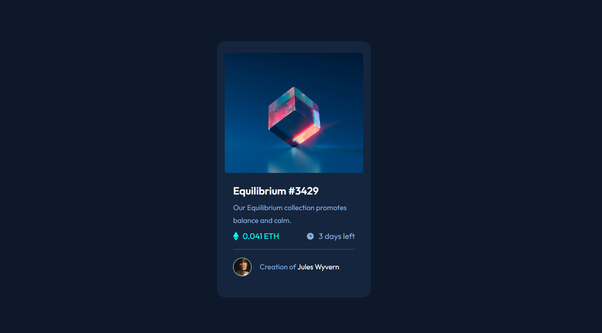

# Frontend Mentor - NFT preview card component solution

This is a solution to the [NFT preview card component challenge on Frontend Mentor](https://www.frontendmentor.io/challenges/nft-preview-card-component-SbdUL_w0U). Frontend Mentor challenges help you improve your coding skills by building realistic projects. 

## Table of contents

- [Overview](#overview)
  - [The challenge](#the-challenge)
  - [Screenshot](#screenshot)
  - [Links](#links)
- [My process](#my-process)
  - [Built with](#built-with)
  - [What I learned](#what-i-learned)
  - [Continued development](#continued-development)
- [Author](#author)
- [Acknowledgments](#acknowledgments)

**Note: Delete this note and update the table of contents based on what sections you keep.**

## Overview

### The challenge

Users should be able to:

- View the optimal layout depending on their device's screen size
- See hover states for interactive elements

### Screenshot

### Links

- Solution URL: [Add solution URL here](https://your-solution-url.com)
- Live Site URL: [Add live site URL here](https://your-live-site-url.com)

## My process

### Built with

- Semantic HTML5 markup
- CSS custom properties
- Flexbox
- CSS Grid
- Mobile-first workflow
- [React](https://reactjs.org/) - JS library
- [LessCSS](https://lesscss.org/) - CSS Framework

### What I learned

I worked some more with LessCSS and figured out how to use mobile-first workflow to make my workflow much quicker without needing something like TailwindCSS. Also, worked a bit more with Grid CSS. I think I still prefer Flexbox at this point though :(

### Continued development

Following on from this project, I think it's fairly clear I probably need to do some more work on working with CSS grid. I enjoy using flexbox a lot because it's convenient but grid seems better for fixed layouts.

## Author

- Website - [Josh Mo](https://joshmo.dev)
- Frontend Mentor - [@joshua-mo-143](https://www.frontendmentor.io/profile/joshua-mo-143)
- Twitter - [@joshmo_dev](https://www.twitter.com/joshmo_dev)
